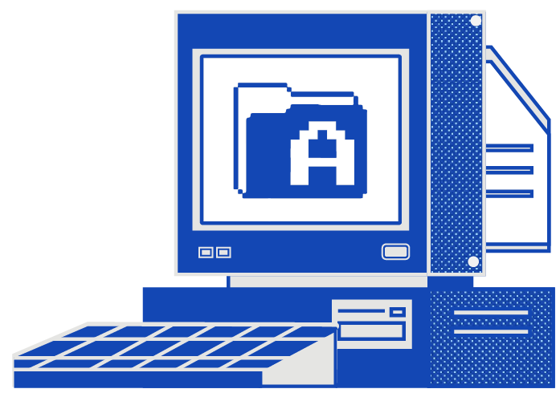
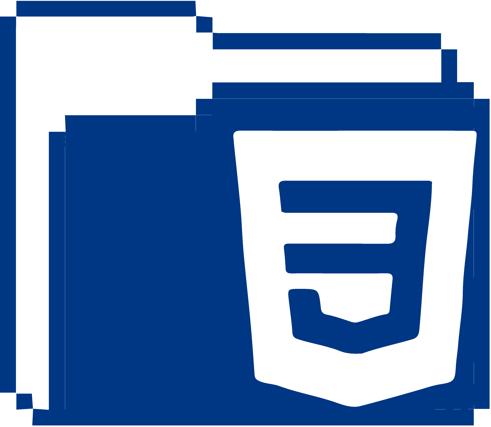
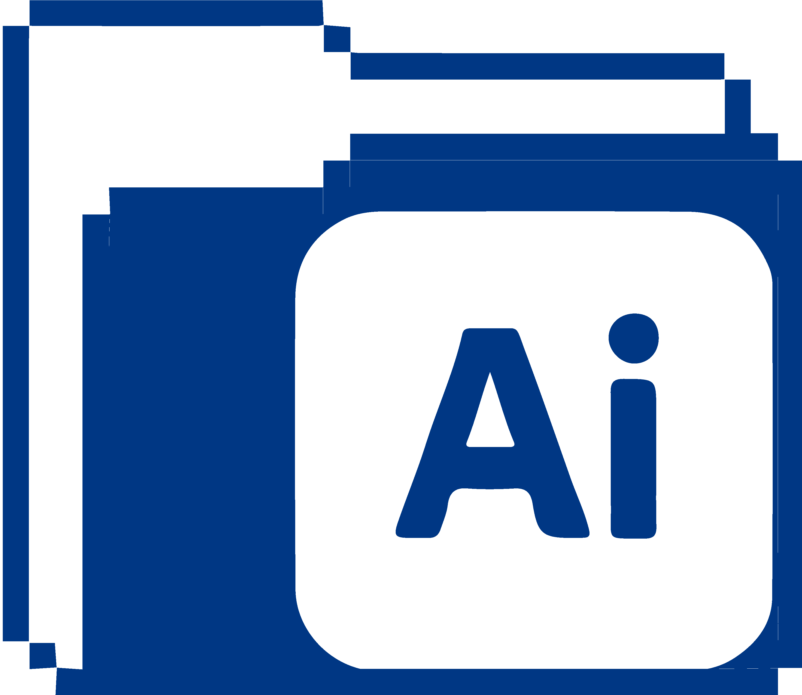

## 👋 Hello there , I'm Aliaa :

 

- 🔍 I'm a curiosity driven junior Front-end developer with a background in design.
- 💻 I enjoy learning new technologies and bringing static designs and concepts to life.
- 🎨 Skilled in creating responsive websites, UI Design, Branding and Logo illustration.
- 🔭 Currently working on improving my React and javaScript skills.
- ⚡ Available for Freelance projects/internship opportunities.

## 🧰 My Skills :
 

&nbsp;
&nbsp;
&nbsp;
&nbsp;
&nbsp;

  

## 📫 Contact me :
 

  &nbsp;
  &nbsp;

  &nbsp;
  

