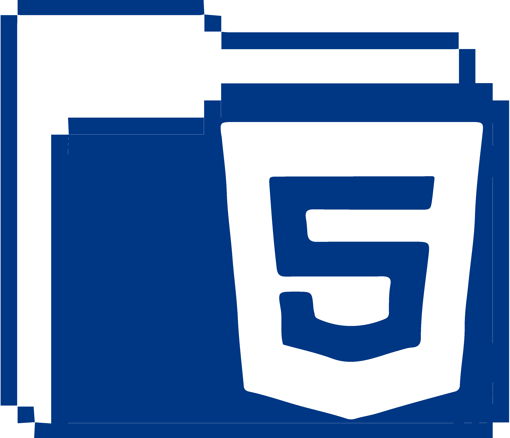

# Hey there :wave:, I'm Aliaa 

### A few things about me
- I am frontend web developer doing all things creative to make the web a more unique and awesome place.
- Coffee, photography, music and art are my happy places 
- I enjoy bringing a static design or idea to life and learning new technologies.
- Skilled in creating responsive designs, UI Design, HTML Emails, copywriting, and social media marketing.
<!-- - Graduated in 2021 with a B.S. in Web Design & Development from Southern New Hampshire University
 - Currently working on a web application for film photography and for international travel -->

 

---

####  LANGUAGES & TOOLS :

  
  
  
  
  
  
  
  
 

## Have a project you want to collaborate on or you just want to chat? You can contact me through either method below:

    
  &nbsp;
  &nbsp;
  &nbsp;
  
  
  
  <h2>Talk to you soon!</h2>

### Hi there 👋

**Aliaa-Nabil/Aliaa-Nabil** is a ✨ _special_ ✨ repository because its `README.md` (this file) appears on your GitHub profile.

Here are some ideas to get you started:

- 🔭 I’m currently working on ...
- 🌱 I’m currently learning ...
- 👯 I’m looking to collaborate on ...
- 🤔 I’m looking for help with ...
- 💬 Ask me about ...
- 📫 How to reach me: ...
- 😄 Pronouns: ...
- ⚡ Fun fact: ...

