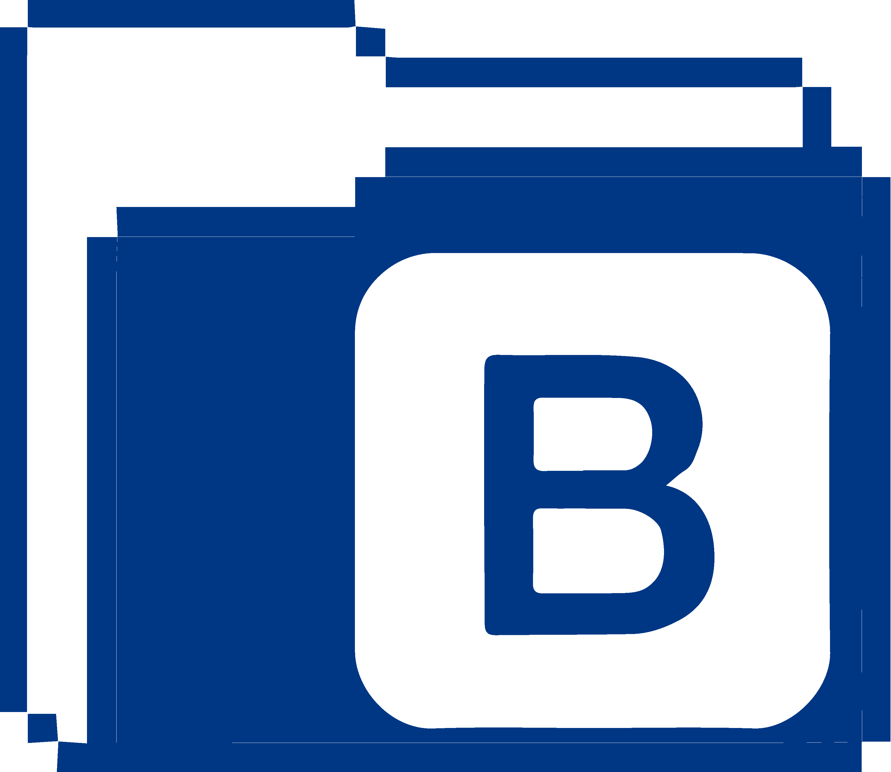

### 👋 Hi there , I'm Aliaa :

- I'm a curiosity driven junior Front-end developer with a background in design.
- I enjoy learning new technologies and bringing static designs and concepts to life.
- Skilled in creating responsive websites, UI Design, Branding and Logo illustration .
- 🔭 Currently working on improving my React skills and understanding of java script to bring my ideas to life .
- ⚡  Available for Freelance projects/internship opportunities.

### My Technical skills :

  &nbsp;
  &nbsp;
  &nbsp;
  &nbsp;
  
  
  
  
 

### 📫 Reach me at :

  &nbsp;
 
  
  

