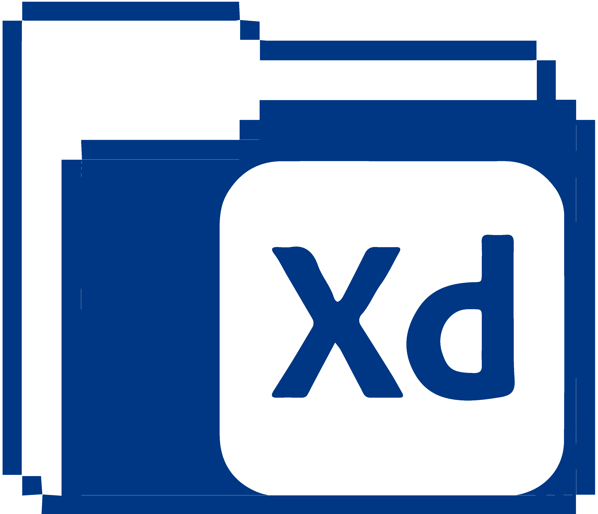

# Hey there :wave:, I'm Aliaa 

### A few things about me
- I am frontend web developer doing all things creative to make the web a more unique and awesome place.
- I enjoy bringing a static design or idea to life and learning new technologies.
- Skilled in creating responsive designs, UI Design, Branding , Logo design , and social media marketing.
<!-- - Graduated in 2021 with a B.S. in Web Design & Development from Southern New Hampshire University
 - Currently working on a web application for film photography and for international travel -->

 

---

####  My Technical skills :

  &nbsp;
  &nbsp;
  &nbsp;
  &nbsp;
  
  
  
  
 

## contact me:

    
  &nbsp;
 
 
  
  
  

